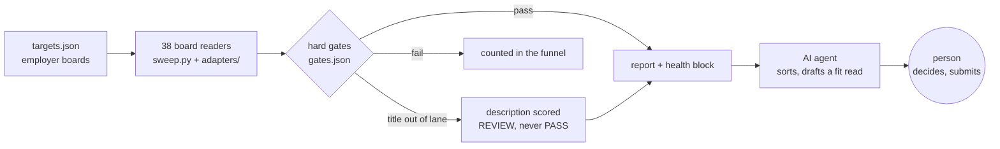

# maxq

[](https://github.com/mpwilso/maxq/actions/workflows/tests.yml)

**A human-in-the-loop job search pipeline, built by an AI coding agent under written rules.**

maxq reads employers' own job boards across 38 applicant-tracking systems, runs every posting through
deterministic gates, and hands a person a short, honest list to decide on. It never applies to
anything. The code was written by Claude Code (Anthropic's coding agent) working to a spec and a set
of operating rules; 363 offline tests, fail-closed checks and human approval decide what ships.

The domain is job discovery. The subject is how to make agent-built software trustworthy.

## What this demonstrates

- **Governing an AI agent's work**: written operating rules ([docs/AGENT_RULES.md](docs/AGENT_RULES.md)),
  every real-world defect turned into a regression test ([docs/DEFECT_LOG.md](docs/DEFECT_LOG.md)),
  and a clear line between what code decides and what a person decides.
- **Failure-mode-driven design**: a small result is a suspected bug until the numbers explain it;
  missing coverage is reported, never silent; nothing is closed on an incomplete read.
- **Product judgment**: a fit read and a separate "will this reach a human" read, kept apart on purpose;
  a sort hint that never filters; an optimization measured before it is trusted.
- **Engineering discipline**: a plugin contract for new board types, fixture-backed tests with fully
  synthetic data, CI on every push, and a privacy scan on every commit.

## Quick start

Python 3.12. About two minutes to a first report.

```
python -m venv .venv
.venv\Scripts\activate            # macOS/Linux: source .venv/bin/activate
pip install -r requirements.txt

python sweep.py --selftest                                    # offline: sample postings through the gates
python -m unittest discover -s tests -t .                     # offline: 363 tests
python sweep.py --targets examples/targets.quickstart.json    # live: three small public boards
```

The last command writes `reports/SWEEP_REPORT_<date>.md`. Open it; `reports/SAMPLE_REPORT.md` shows
what a larger run looks like. To see one board's postings and gate verdicts without touching stored state:
`python adapters/probe.py --company "Notion"`.

## How it works



| Step | Who decides |
|---|---|
| Read boards, apply hard gates, detect coverage gaps | Code (deterministic, tested) |
| Sort the unscored pile, draft a fit assessment | AI agent |
| Which roles are worth an application | Person |
| Submitting anything | Person, always |

What the sweep does on every run:

- **Reads each employer's own board**, never an aggregator. 13 readers live in `sweep.py`; 25 are
  plugins in `adapters/`, each behind one small contract ([adapters/README.md](adapters/README.md)).
- **Applies hard gates in code**: title lane, a fail-closed location policy (a posting passes only on a
  positive location marker), a required-years bar with degree tiers and escape clauses, and
  out-of-scope domains. Every threshold lives in `gates.json`.
- **Rescues on the description**: a posting whose title is outside the lane still runs every other
  gate, and a strong description surfaces it for review, never as a pass.
- **Reports coverage honestly**: an employer that errors is retried once, then reported as UNCOVERED.
  A posting missing from a board that errored is carried forward for up to 14 days, not closed. A read
  that comes back under half its usual size is treated as truncated.
- **Prints a health block**: the full funnel, uncovered employers, big count drops, and a pass volume
  that fell sharply. In the sample run, 2,364 postings from seven employers came down to 22 passes and
  17 for review, with nothing uncovered.

## Make it yours

`gates.json` ships with a fictional candidate, **John Doe**: a product and program manager for finance
and business systems (NetSuite, Coupa, ERP) in Denver, open to remote, with 4.5 years in role. None of
it describes a real person. These are the keys to change first; leave the rest as they are until you
need them.

| Key | What it does |
|---|---|
| `title_include_any` / `title_exclude_any` | Title phrases that put a posting in or out of your lane |
| `title_lane_override` | Phrases that let a title past the engineering-title guard (below) |
| `endorsed_onsite_markets` | Cities you would work in onsite or hybrid |
| `blocked_us_markets` | US cities you rule out (also list them in `location_fail_any`) |
| `endorsed_foreign_markets` | Non-US cities you would take, with the knockout note to show |
| `candidate_years_total` | Your years of relevant experience, for the years-gap read |
| `reach_years_from` / `years_hard_fail_over` | A required-years bar from this is labelled REACH; over this it fails |
| `never_claim_terms_in_requirements` | Phrases that flag a posting (never fail it), such as "security clearance" |
| `prerank` | The lexicon that sorts unscored postings and scores descriptions for rescue |

Two things to know:
- The title gate is tuned for product and program roles. Titles naming an engineer, developer or
  architect fail unless they also name product or program work, or match `title_lane_override`.
- After editing `gates.json`, run `python sweep.py --report-only`. It re-gates the last snapshot
  without a network call and lists what became eligible: that is the edit's blast radius.

Replace `targets.json` with the employers you want. Each entry names an `ats` (the adapter) and where
the board lives; the 53 entries here are examples covering 33 board types.

## Reading the output

- `reports/SWEEP_REPORT_<date>.md`: the report. Section 1 is new gate-passing postings, section 2 is
  postings flagged for a person to review, section 5 is coverage per employer.
- `data/`: the sweep's state (snapshots, first-seen dates, stored job descriptions). Delete it to start
  over.

| Term | Meaning |
|---|---|
| req | One job posting |
| lane | The title families you are looking for |
| PASS | Cleared every gate |
| REVIEW | Worth a person's look, never counted as a pass (a rescued title, an IC role under a manager title) |
| LOCATION-POLICY | A US city that is not one of your markets |
| TENURE / REACH | A required-years bar over your limit / above your years but under the limit |
| UNCOVERED | The board could not be read this run; its postings are carried, not closed |
| carried forward | Kept open because the read that would close it was incomplete |
| conversion read | Separate from fit: how likely an application reaches a human (years gap, level, posting age, crowded board, known contacts) |

## Design decisions and trade-offs

- **Employer boards over aggregators.** More adapters to maintain, in exchange for data that is
  current and complete.
- **Carry forward over close.** A posting is closed only by a clean, complete read of an enumerable
  board. Occasionally a closed role lingers; a live role never silently disappears.
- **Fail-closed location.** A posting with no recognizable location fails. Some good roles need a second
  look; none from the wrong country slip through.
- **REVIEW is never PASS.** Rescued postings and ambiguous manager titles go to a person, so the pass
  count and its health warnings keep meaning something.
- **Measure before trusting.** Conditional requests (ETag) run in measurement mode; trust is switched
  on in `gates.json` only after three consecutive clean full sweeps agree.
- **One core file, plugins at the edge.** `sweep.py` holds the gates, state and the original readers in
  one place; new board types are plugins with their own tests. Splitting the core is the next refactor.

Known limits: body rescue has a high false-positive rate by design (a person reviews every one), its
score floor is not yet validated against outcomes, and the engineering-title guard is code, not config.

## Being a polite reader

maxq reads the same public, unauthenticated listing data each employer's careers page loads in a
browser. It identifies itself with a descriptive User-Agent, waits between requests, backs off on 429
and 5xx responses and honours Retry-After, uses conditional requests where a board supports them, and
never reads a site that requires a login. Check each site's terms before running it at scale.

## How this was built

I designed the architecture, the gates and the rules for when the pipeline may and may not decide
something on its own, and wrote them down as operating instructions. Claude Code wrote most of the code
under those instructions. I reviewed its work against the rules, and every defect we found in real data
became a regression test in the same session. The rules are in [docs/AGENT_RULES.md](docs/AGENT_RULES.md)
and a selection of the defects in [docs/DEFECT_LOG.md](docs/DEFECT_LOG.md).

History starts at a clean public snapshot. Personal data never enters this repository: the maintainer
runs `tools/privacy_scan.py` on every commit and push through opt-in hooks
(`git config core.hooksPath .githooks`) against a local, gitignored blocklist.

## Roadmap

This is **Phase 1: discovery**. Phase 2 adds the checks between a tailored resume and anything that
gets sent:
- every resume line must trace to a verified claim about the candidate, or the build is blocked;
- deterministic checks on the page (one page, no unsupported metrics, no titles the candidate has not
  held) before any reviewer sees it;
- an independent review pass and a person's approval before a file is released.

## License

MIT. See `LICENSE`.
