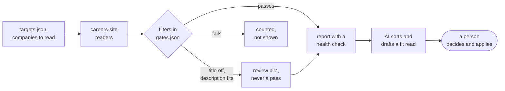

<p align="center">
  <picture>
    <source media="(prefers-color-scheme: dark)" srcset="docs/brand/lockup-animated-dark.svg">
    
  </picture>
</p>

[](https://github.com/mpwilso/Project-Max-Q/actions/workflows/tests.yml)

Job hunting at volume is mostly noise. Listing sites are stale and incomplete, and a slow week looks
exactly like a broken search. I built Max Q to fix that for myself: it reads job postings straight from
each company's own careers site, filters out the ones that don't fit, and gives me a short list to
decide on. It never applies to anything. I make every call that matters.

I also built it as an experiment in working with an AI coding agent. Claude Code wrote most of the
code. I wrote the rules it had to follow, decided what it could and couldn't decide on its own, and
held it to one standard: any bug we found in real data got a test before we moved on.

**At a glance**
- Reads about 40 kinds of company careers sites directly, with no job-listing sites in between.
- In the sample run, 2,364 postings from seven companies came down to 22 matches and 17 for a person to
  review, and every company was read.
- A Claude-based scorer ranks the short list. On a 24-posting test set it matched the expected answer
  79% of the time, against 46% for plain keyword matching.
- A resume check blocks any line that isn't backed by a verified claim about the candidate.
- 400+ automated tests run on every change.

Max Q is the moment a rocket takes the most stress on the way up; job searching felt about the same.

## What you get

Each run writes a report. It opens with a health check that accounts for every posting and every
company, then lists the matches. Trimmed from [reports/SAMPLE_REPORT.md](reports/SAMPLE_REPORT.md):

```
Funnel: 2364 postings from 7 employers -> 1107 title excluded, 1066 title out of lane,
        95 no US location, 51 outside your markets, 5 over the years limit
        -> 17 for review -> 22 PASS. 0 employers unread.

Databricks · Senior Customer Enablement Program Manager
  Location:        United States
  Comp:            $117,400 – $161,350
  Conversion read: LOW · years gap +2 (6+ stated vs 4.5 held) · posted 138d ago · flooded board
  Flags:           VERIFY LOCATION: the board names only the country; REACH: 6+ years stated
```

The **conversion read** is a separate question from fit: not "could I do this job?" but "will this
application reach a person?" Required years, a level jump, an old posting and a flooded board (hundreds of
applicants per posting) each count against it.

## The finding I learned the most from

The first version of the Claude scorer spotted every dealbreaker in the test set (five days onsite in
New York, a job in Canada, a six-month contract) and still scored those jobs 78 to 90, because location
was only 10 points of the rubric. I fixed it in code, not in the prompt: any dealbreaker now means skip.
Bad jobs at the top of the list went from 3 to 0. [The numbers and the caveats](#ranking-by-fit-and-measuring-it).

## What's worth looking at

- **How the AI agent was managed.** The rules it worked under are in
  [docs/AGENT_RULES.md](docs/AGENT_RULES.md), and the real bugs it hit, with the test that now guards
  each one, are in [docs/DEFECT_LOG.md](docs/DEFECT_LOG.md). When a written rule didn't stop the agent
  repeating a mistake, the rule became a check that blocks the commit ([defect 12](docs/DEFECT_LOG.md#12-a-one-line-edit-that-rewrote-the-whole-file)).
- **Designing for the ways things break.** A suspiciously small result is treated as a bug until the
  numbers explain it. A careers site that can't be read gets reported, not quietly skipped. Nothing is
  marked closed unless the whole site was read cleanly.
- **Measuring an AI feature before trusting it.** The Claude scorer is measured against a labeled set of
  postings, next to a plain keyword baseline, before it ranks anything.
- **Keeping the decisions straight.** Code handles the filters, the AI sorts and drafts, and a person
  decides and submits. Whether I'm a fit and whether an application will reach a person are scored
  separately.
- **Engineering basics.** A plugin setup for adding new careers sites, tests built on made-up data,
  automatic checks on every push, and a privacy scan before anything leaves my machine.

## Quick start

Python 3.12. About two minutes to a first report. No API key or account needed.

```
python -m venv .venv
.venv\Scripts\activate          # Windows cmd
# PowerShell: .venv\Scripts\Activate.ps1   Git Bash: source .venv/Scripts/activate
# macOS/Linux: source .venv/bin/activate
pip install -r requirements.txt

# offline: run sample postings through the filters
python sweep.py --selftest

# offline: the full test suite
python -m unittest discover -s tests -t .

# live: read three small public careers sites
python sweep.py --targets examples/targets.quickstart.json
```

The last command takes about a second and writes `reports/SWEEP_REPORT_<date>.md`. Open it;
`reports/SAMPLE_REPORT.md` shows what a larger run looks like. To test one company's careers site
without touching stored state, run `python adapters/probe.py --company "Notion"`: it prints how many
postings it read, how the filters sorted them, and a few samples.

A plain `python sweep.py` reads every company in `targets.json`. With the 53 examples that is about
25,000 postings and 20 minutes or more on the first run, most of it fetching full job descriptions.
It prints a progress line about every 30 seconds, and the console lists the first 25 new matches (the
report has all of them). Later runs are faster, because unchanged postings aren't fetched again.

What it does not do: apply to jobs, log in anywhere, read LinkedIn or job-listing sites, or call an AI
model unless you choose the Claude scorer.

**Reading the code?** Start small: [adapters/tiktok.py](adapters/tiktok.py) is one careers-site reader
(126 lines), [claimcheck.py](claimcheck.py) is the resume check (89 lines), and
[fitscore.py](fitscore.py) is the scorer. [sweep.py](sweep.py) is the 4,000-line engine that runs
everything else.

## How it works



| Step | Who decides |
|---|---|
| Read careers sites, apply the filters, find sites that couldn't be read | Code (tested, same answer every time) |
| Sort the unscored pile, draft a fit assessment | AI agent |
| Which roles are worth an application | Person |
| Submitting anything | Person, always |

What the sweep does on every run:

- **Reads each company's own careers site**, never a job-listing site. A few readers live in
  `sweep.py`; the rest are plugins in `adapters/`, each behind one small contract
  ([adapters/README.md](adapters/README.md)).
- **Filters in code**: job title, a location rule that fails closed (a posting passes only when its
  location clearly matches), a required-years limit that understands degree tiers and escape clauses,
  and out-of-scope fields. Every threshold lives in `gates.json`.
- **Gives a second look on the description**: a posting whose title is off still runs every other
  filter, and a strong description flags it for review, never as a pass.
- **Reports what it couldn't read**: a company whose site errors is retried once, then reported as
  UNCOVERED. A posting missing from a site that errored is carried forward for up to 14 days, not
  closed. A read that comes back under half its usual size is treated as cut off.
- **Prints a health block**: the full funnel, unread companies, big count drops, and a pass volume that
  fell sharply.

<details>
<summary><b>Make it yours: set up your own search</b></summary>

`gates.json` ships with a fictional candidate, **John Doe**: a product and program manager for finance
and business systems (NetSuite, Coupa, ERP) in Denver, open to remote, with 4.5 years in role. None of
it describes a real person. These are the keys to change first; leave the rest as they are until you
need them.

| Key | What it does |
|---|---|
| `title_include_any` / `title_exclude_any` | Title phrases that put a posting in or out of your lane |
| `title_lane_override` | Phrases that let a title past the engineering-title guard (below) |
| `endorsed_onsite_markets` | Cities you would work in onsite or hybrid |
| `endorsed_state_codes` | Whole US states you would work in, by two-letter code (list the state's full name in `endorsed_onsite_markets` too). A segment with a Canadian province code never counts, because boards also write Canada as "CA" |
| `endorsed_exact_segments` | Locations that endorse only as a whole segment: a bare "New York" is the city, while the words inside "Tarrytown, New York" are the state |
| `blocked_us_markets` | US cities you rule out (also list them in `location_fail_any`) |
| `endorsed_foreign_markets` | Non-US cities you would take, with the knockout note to show |
| `candidate_years_total` | Your years of relevant experience, for the years-gap read |
| `reach_years_from` / `years_hard_fail_over` | A required-years bar from this is labelled REACH; over this it fails |
| `never_claim_terms_in_requirements` | Phrases that flag a posting (never fail it), such as "security clearance" |
| `prerank` | The lexicon that sorts unscored postings and scores descriptions for rescue |

Two things to know:
- The title filter is tuned for product and program roles. Titles naming an engineer, developer or
  architect fail unless they also name product or program work, or match `title_lane_override`.
- After editing `gates.json`, run `python sweep.py --report-only`. It re-filters the last snapshot
  without a network call and lists what became eligible: that is the edit's blast radius.

Replace `targets.json` with the companies you want. Each entry names an `ats` (the reader to use) and
where the careers site lives; the entries here are examples covering most of the supported site types.
The easiest way to add a company is to copy an example of the same site type, change the company's
identifier (usually the name in its careers URL), and run `python adapters/probe.py --company "<name>"`
to confirm it reads. A typo in `gates.json` or a targets file stops the run with one line naming the
file, line and column.

To rank against your own profile instead of John Doe's, write your own profile and rubric (copy the
ones in [examples/john_doe/](examples/john_doe/)) and pass them in:
`python fitscore.py rank --scorer claude-code --profile me/profile.md --rubric me/rubric.md`.

</details>

<details>
<summary><b>Reading the output: files and terms</b></summary>

- `reports/SWEEP_REPORT_<date>.md`: the report. Section 1 is new postings that passed, section 2 is
  postings flagged for a person to review, section 5 is coverage per company.
- `data/`: the sweep's state (snapshots, first-seen dates, stored job descriptions). Delete it to start
  over.

| Term | Meaning |
|---|---|
| req | One job posting |
| board | One company's careers site |
| lane | The title families you are looking for |
| PASS | Cleared every filter |
| REVIEW | Worth a person's look, never counted as a pass (a rescued title, an IC role under a manager title) |
| LOCATION-POLICY | A US city that is not one of your markets |
| TENURE / REACH | A required-years bar over your limit / above your years but under the limit |
| UNCOVERED | The site, or one posting's detail page, could not be read this run; those postings are carried, not closed |
| carried forward | Kept open because the read that would close it was incomplete |
| conversion read | Separate from fit: how likely an application reaches a person (years gap, level, posting age, crowded board, known contacts) |

</details>

## Ranking by fit, and measuring it

After the filters, `fitscore.py` ranks what's left by how well each posting fits the profile. The
ranking only changes the order: every posting that passed is still listed, and a person still decides.

```
python fitscore.py rank                        # keyword baseline, offline
python fitscore.py rank --scorer claude-code   # Claude via Claude Code, no API key
python fitscore.py rank --scorer claude        # Claude via the API
```

The Claude scorer sends the profile and rubric ([examples/john_doe/](examples/john_doe/)) with each
posting and gets back a structured answer: points per rubric area, strengths, gaps and dealbreakers.
Code checks that the areas are in range and add up to the score, and sets the verdict from the score,
so the label and the number can never disagree, and any dealbreaker makes the verdict skip. A declined
or cut-off answer is reported, not guessed. The `claude-code` scorer runs each posting as a locked-down
`claude -p` session (no tools, no settings, nothing saved) on a Claude subscription; the `claude` scorer
calls the API and needs `pip install -r requirements-ai.txt` and an API key.

Whether it is any good is measured, not assumed. `evals/run_fit_eval.py` scores 24 made-up postings
labeled apply, maybe or skip, including traps: the right title on the wrong job, the right job under an
odd title, a good job in a place he can't work.

| Scorer (24 postings) | Agrees with label | Apply precision | Apply recall | Bad jobs pushed to the top |
|---|---|---|---|---|
| Keyword baseline | 46% | 42% | 83% | 3 of 12 |
| Claude (Opus 5.5), first run | 67% | 50% | 100% | 3 of 12 |
| Claude, plus the dealbreaker rule | 79% | 67% | 100% | 0 of 12 |

The first Claude run caught every good job but pushed three bad ones to the top: five days onsite in
New York, a role in Canada, and a six-month contract. In each case the model had named the problem as a
dealbreaker and still scored the job 78 to 90, because location is only 10 points of the rubric. The
fix went in code, not the prompt: a dealbreaker now makes the verdict skip. The third row replays the
same recorded answers under the new rule, so no model call changed; it also means the rule was chosen
after seeing this set, and a fresh set is the real test.

Two caveats. The labels were written against John Doe's profile by the project's AI coding agent, so
this is a consistency check rather than independent ground truth. And the scorer and the labeler are the
same model family. Recorded answers are in [evals/recorded/](evals/recorded/), full reports in
[evals/results/](evals/results/). Your own labeled postings can go in `evals/local/`, which is
gitignored, so real job data never leaves your machine.

## Keeping the resume truthful

A tailored resume is where an AI assistant is most tempted to embellish. `claimcheck.py` stops that
in code: every bullet must cite a verified claim about the candidate (`[claim-id]`), and a line is
blocked if it states a figure, a system or a title those claims don't support, or anything on the
never-claim list.

```
python claimcheck.py examples/john_doe/resume.md            # every line traces: passes
python claimcheck.py examples/john_doe/resume_blocked.md    # 5 of 6 lines blocked, with reasons
```

The blocked example shows each rule catching something: an inflated number (600 requesters, not
420), people management he never did, a tool none of his claims mention, a title he never held, and a
line with no source at all. One blocked line blocks the whole resume, so the fix is always to change
the wording or add a verified claim, never to talk the check out of it.

## Roadmap

Finding and filtering postings is done. The current phase is the checks between a tailored resume and
anything that gets sent. Done so far: the resume check (above). Next:
- a second, independently labeled set to confirm the fit scorer's numbers;
- more page checks before any reviewer sees a draft (one page, no hedged or unsupported metrics);
- an independent review pass and a person's approval before a file is released.

## Contributing

Tests run with `python -m unittest discover -s tests -t .` and on every push. `.githooks/` holds the
maintainer's privacy guard: it refuses every commit until `.privacy/config.json` (gitignored) lists the
names and addresses to block, for example `{"patterns": ["your full name"]}`.
Create that file before running `git config core.hooksPath .githooks`, or leave the hooks off.

## License

MIT. See `LICENSE`.

Built by Matt Wilson · [LinkedIn](https://www.linkedin.com/in/mwilso)
